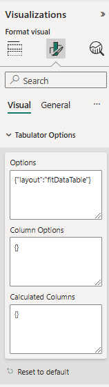

# Custom Layouts Documentation for Tabulator Options

## Table of Contents
1. [Introduction](#introduction)
2. [Tabulator Options](#tabulator-options)
    - [Maximum Table Height](#maximum-table-height)
    - [Minimum Table Height](#minimum-table-height)
    - [Row Height](#row-height)
    - [Column Layout Modes](#column-layout-modes)
    - [Responsive Layout](#responsive-layout)
    - [Table Resizing](#table-resizing)
3. [Column Options](#column-options)
    - [Column Layout](#column-layout)
    - [Width Grow and Shrink](#width-grow-and-shrink)
    - [Responsive Columns](#responsive-columns)
    - [Min and Max Width](#min-and-max-width)
4. [Text Direction](#text-direction)
5. [Other Customizations](#other-customizations)

---

## Introduction

This document outlines the configuration options for the **Tabulator Custom Visual** within Power BI, which allows you to configure various table and column properties using Tabulator options. The configuration options enable you to control table dimensions, column layouts, responsiveness, row heights, and more.



---

## Tabulator Options: Options

### Maximum Table Height
To set the maximum height of the table, use the `maxHeight` option under **Options** in Tabulator Options. This ensures the table height doesn’t exceed a specified limit.

```json
{
  "maxHeight": 500
}
```

### Minimum Table Height
Similarly, use the minHeight option to set a minimum table height, ensuring that the table doesn’t shrink smaller than the defined value.

```json
{
  "minHeight": 200
}
```

### Row Height
The rowHeight option allows you to set a fixed height for each row. This ensures uniform row sizes across the table.

```json
{
  "rowHeight": 30
}
```

### Column Layout Modes
You can control how the columns are displayed within the table using different layout modes. Below are the available layout modes under **Options** in Tabulator Options

#### fitData
Adjusts column widths based on the content in the cells. The table fits the data without any empty space.

```json
{
  "layout": "fitData"
}
```

#### fitDataFill
Columns adjust to fill the available space while considering the content size. This layout mode ensures the columns stretch to fit without overflow.

```json
{
  "layout": "fitDataFill"
}
```
#### fitDataStretch
This mode stretches all columns to occupy the available width of the table. It may cause columns to expand beyond the content width.

#### fitDataTable
The table layout adjusts to fit the available height, dynamically resizing the columns to maintain readability. This layout is the default setting in this custom visual.

#### fitColumns
Columns automatically resize to fit the table's width. Columns that don't have a specified width are resized dynamically. A scrollbar will appear if the table content exceeds the width.

### Text Direction
Tabulator supports both Right to Left (RTL) and Left to Right (LTR) text directions. You can configure the table to use a specific direction.
```json
{
  "textDirection": "ltr"
}
```

### Placeholder
You can specify a placeholder message for when the table has no data.
```json
{
  "placeholder": "No Data Available"
}
```

## Tabulator Options: Column Options

Column-specific configurations are placed under the Column Options section. These options allow you to control the behavior and appearance of each individual column.

Column Layout
For each column, you can set properties like width, responsive, and minWidth under Column Options. The format is:

```json
{
  "<columnname>": {
    "width": 200,
    "responsive": 1
  }
}
```

Example for columns:
```json
{
  "Name": {
    "width": 200,
    "responsive": 0
  },
  "Age": {
    "width": 100,
    "widthGrow": 2
  }
}
```

### Width Grow and Shrink
The widthGrow property determines how much space a column will occupy when there is extra available space. Similarly, widthShrink dictates how much a column should shrink when space is constrained.

Example:
```json
{
  "Age": {
    "widthGrow": 2
  },
  "Gender": {
    "widthShrink": 1
  }
}
```

### Responsive Columns
Columns can be made responsive with the responsive property. This will ensure they are hidden or adjusted based on the available table width.

Example:
```json
{
  "Name": {
    "responsive": 0
  },
  "Age": {
    "responsive": 3
  }
}
```

### Min and Max Width
Prevent columns from becoming too narrow or too wide by setting minWidth and maxWidth properties.

Example:
```json
{
  "Name": {
    "minWidth": 120,
    "maxWidth": 200
  }
}
```

## Tabulator Options: Calculated Columns
Calculated Columns can be defined in the Calculated Columns section. You can write functions that derive values based on existing data.

Example for a calculated column:
```json
{
  "TotalPrice": "function(rowData) { return rowData['UnitPrice'] * rowData['Quantity']; }"
}
```

Please refer to the detailed Tabulator documentation[here](https://tabulator.info/docs/6.3)
